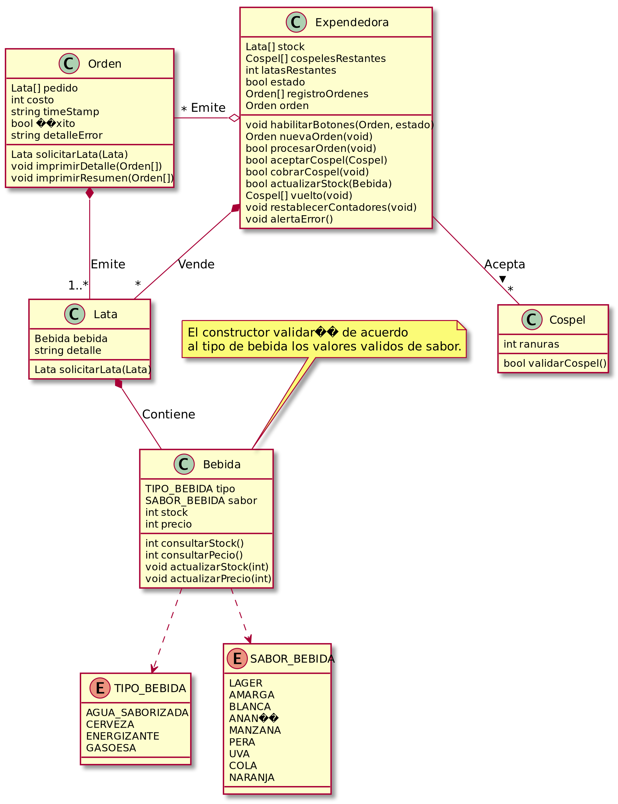
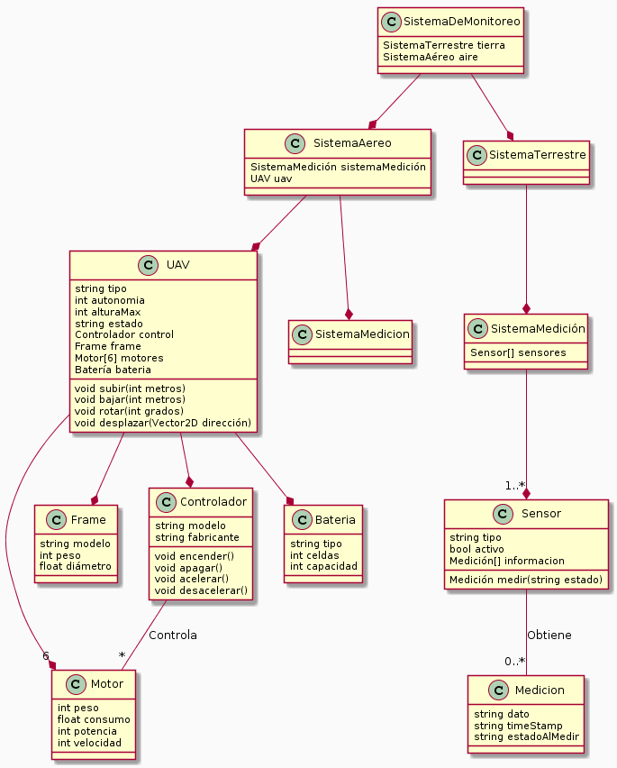
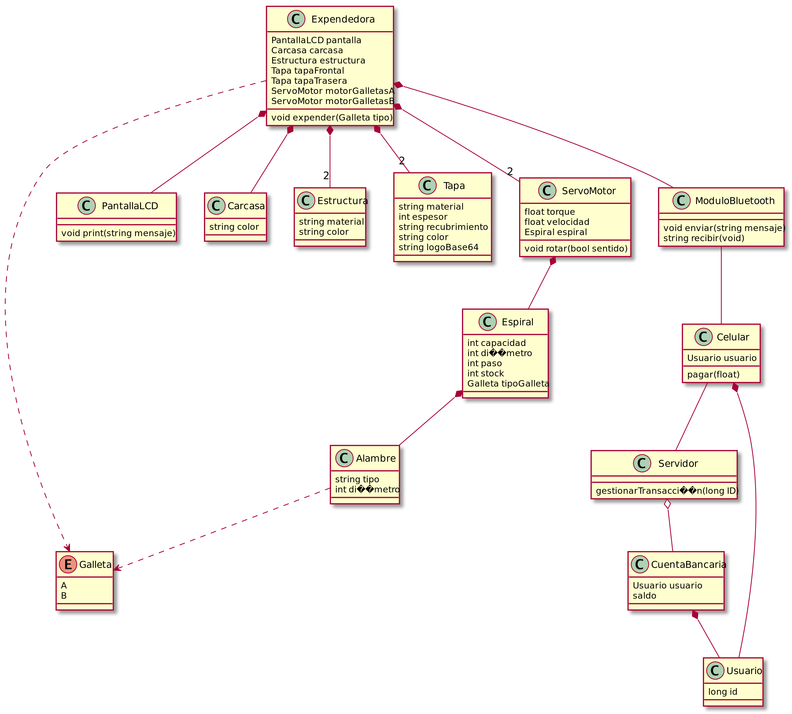
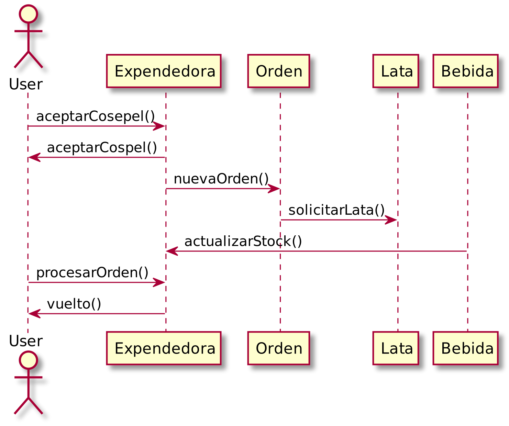
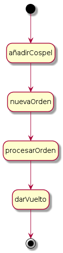

## TRABAJO PRACTICO: UML

#### 1) -Diagrama de Clases correspondiente al software de control de una máquina expendedora de bebidas en lata.

#### 2)- Diagrama de Clases capaz de modelar el siguiente sistema de monitoreo.

#### 3)- Diagrama de Clases para el sistema “Prototipo de Máquina Expendedora con Sistema de Pago Remoto”.

#### 4)- Diagrama de Secuencia para un escenario de trabajo del software de control de una máquina expendedora de bebidas en lata.

#### 5)- Diagrama de Estados para alguna de las entidades sensibles del anterior sistema para el control de una máquina expendedora de bebidas en lata.

